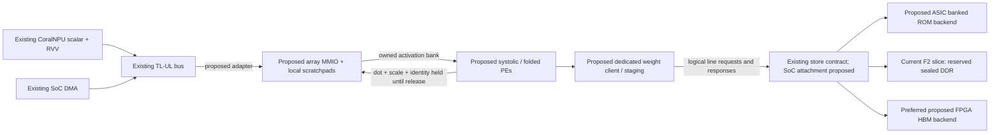

# Ternary systolic array and CoralNPU integration — design draft v0

**Status: proposal for review; no array RTL, firmware or performance result is delivered by this document.**
Source snapshot: `Ergodex-Core/bonsai_on_chip` at `07a4ab8c8f29d2f256d1a3f2732f018d3c9b3bf5`.
Owner and implementation reviewers: to be assigned. The source references below
are repository-relative paths and one-based lines at that snapshot.

## 1. Decision to review

Propose a small **16 output-row × 8 token-column, output-stationary mesh**
(128 integer processing elements, PEs) for prefill, with a separately verified
**folded decode mode** that maps all 128 PEs to different output rows for one
token. Use one PE arithmetic definition in both modes: add, subtract or skip a
signed int8 activation into an int32 group accumulator. Weights reach the array
through the existing logical read-only weight-store contract, with local
packing/line assembly and double-buffered operand staging. **HBM is the preferred
proposed FPGA ROM-equivalent backend**, with the current sealed-DDR first slice
retained as the implemented correctness baseline. ASIC banked ROM is the
separate proposed silicon backend. This choice does not change native formats
or establish HBM/array execution or full-model inference.

These dimensions and the folded routing are engineering proposals, not a fit
or timing commitment. The first implementation should prove one tile, both
mappings, exact group results and a real CoralNPU submission path. HBM correctness
and immutability are a separate backend gate; replication and model-level
precision changes follow their own gates. Preserve DOT128
as a diagnostic reference; do not silently reinterpret its v1 mailbox.

## 2. Existing boundary and what changes

| Area | Current source behavior | Proposed work |
| --- | --- | --- |
| Arithmetic | `hdl/verilog/first_slice/dot128.sv:70` and `:197`: one sign/ternary operation per MAC cycle, 128 iterations, one command | Parallel PE mesh and mode-dependent operand routing; still exact group arithmetic |
| Store | `hdl/verilog/first_slice/weight_store.sv:55` and `:299`: 16 logical slots, but **one physical backend read at a time** | Keep correctness frontend first; add measured prefetch/multiple physical transactions only with a versioned internal adapter and tests |
| Submission | `doc/spec/first_slice.md:36`: AXI-Lite mailbox, one job, inline 128-byte activations, held result until ACK | Separate array ABI and bounded tile descriptors; staging and completion ownership |
| CoralNPU | `doc/spec/first_slice.md:6`: host/testbench stands at CPU-master boundary; no core/RVV integration in this slice | Wire external slave/control path and run firmware on the real core in simulation |
| Scaling | `utils/first_slice/prepare_fixture.py:88` and `doc/spec/first_slice.md:27`: raw FP16 scale plus exact int32 result; host performs one FP32 rounding | First expose exact group results/scales to firmware; add a specified RVV/scalar or hardware scale/reduction stage |
| FPGA | `fpga/aws_f2/first_slice/cl_bonsai_first_slice.sv:19` and `:138`: shell clock, guarded DDR, no HBM path | Reuse logical store semantics; implement/validate the preferred HBM adapter separately from the array wrapper |

The current ERG-103 report explicitly excludes CoralNPU firmware, RVV, full
layers and inference (`reports/ERG-103/README.md:18`). Its simulator coverage
is a regression baseline for the existing slice, not evidence for this array.
Physical FPGA gate status must be taken from the current run report, separately
from this design. The companion weight-store contract distinguishes the
implemented DDR slice from proposed HBM, ASIC ROM and SoC integration.



The three memory boxes are alternative backends, not simultaneous copies. The
current F2 slice remains separate from the existing CoralNPU TL-UL subsystem;
the arrows through the proposed array boundary require new wiring. Scratchpad
ownership is defined below; no core/DMA writer may change an IN_USE bank.

## 3. Workload and formats

Use `Y[M,N] = X[M,K] × W[N,K]^T`: M is token/batch count, N output rows,
K reduction length. Decode normally has M=1; a prefill tile has up to M=8.
This design accelerates the packed-weight linear operation only. Attention,
normalization, activation functions, positional encoding, embedding lookup,
KV-cache allocation and tokenization remain separate software/operators.

Keep these formats distinct:

- **Native Q1_0:** 128 binary signs and one FP16 scale, 18 unchanged bytes per
  group; sign bit j is LSB-first and means `2*bit-1`. Scale bytes are little
  endian. There is no zero code. All 197 native matrices and 113 FP32 vectors
  retain their existing canonical payload and descriptors.
- **Generic ternary2 fixture:** 128 two-bit operations, 32 bytes, codes
  `00=0`, `01=+1`, `10=-1`, `11=invalid`. The current fixture has implicit scale
  FP16 1.0. It exercises three-valued arithmetic, not a native ternary model.
- **Future trained ternary checkpoint:** unresolved model identity, packing,
  group size, scale/zero-point semantics and activation precision. Require a new
  format descriptor and independent decoder. Do not relabel Bonsai Q1_0 or
  append scales to the synthetic format under its existing format ID.

The pinned fixture is Bonsai-1.7B Q1_0, not the planned 27B ternary product.
Its canonical image is 242,357,184 bytes (32 padding bytes), image SHA256
`ccd70c080f8758e1b4df58c2fdbdd6d13bb65571abbc56feb6942de1f8c07d99`.
Native tensor order, 64-byte-aligned starts, unpadded rows and tied embedding/head
alias are fixed by `doc/microarch/weightstore.md:47` and the packer manifest.
A Q1_0 address is `tensor_offset + row*(K/128)*18 + group*18`; use widened range
checks. The largest tensor has 151,669 rows of 288 bytes; output tails matter.

The 27B target also needs the weight store's separate
[capacity and addressability gate](weightstore.md#27b-capacity-and-addressability-gate).
Physical HBM size and tile replication do not expand the current 256 MiB image
limit. Freeze the larger-image ABI and a checkpoint-derived budget for all tensor
formats/scales plus peak KV/activation/workspace residency before a 27B fit claim.

## 4. Dataflow and utilization

**Prefill mode:** PE(r,c) owns one `(output row r, token c)` group accumulator.
For each k in a 128-element group, weight operations move horizontally and
activation bytes vertically, with boundary skew so both operands at a PE name
the same k. Each PE accumulates locally. Valid/epoch/job/group metadata travels
with operands. All mesh registers advance under one stall enable in v0; a stalled
stage freezes operands, valid bits, counters and accumulators together. Local
elastic pipelines are a later optimization with separate alignment proofs.

A conservative isolated group wave takes `128 + (16-1) + (8-1) = 150` compute
cycles, excluding load, scale/output drain and any stalls. Its useful occupancy
is `128/150 = 85.3%` for a full tile. This is an analytical schedule, not RTL
measurement. Overlapping group waves would require distinct accumulator banks
and explicit group identity; v0 does not assume that overlap.

For M=1 the same conventional mesh uses only one of eight columns: 12.5% of
PEs before wave overhead. Mapping fewer tokens onto inactive columns without
changing routing cannot improve that utilization.

**Folded decode mode:** map PE(r,c) to row `r + 16*c`, at a single token. A
registered broadcast supplies the same activation k to every PE, while each
PE reads its own staged operation k and scale. This is a row-parallel SIMD
mode sharing the PE array, **not a claim that a conventional GEMM systolic
mapping achieves full decode utilization**. It needs different weight fanout,
local addressing and broadcast routing; prove them explicitly. In its ideal
steady MAC interval all 128 PEs perform useful operations for N≥128; cost is
128 distinct weight groups instead of 16, so memory bandwidth becomes more
important. Broadcast/setup/drain latency and tails reduce utilization.

V0 mode changes happen only while the tile is idle and drained. Mask inactive
M/N lanes, never read beyond tensor bounds, and never count masked work as useful
operations. Native v0 K must be a positive multiple of 128; reject unsupported
K tails rather than inventing padding within the canonical image. General K
tails need a future valid-element descriptor with zero-masked activations.

## 5. Arithmetic contract

For token m, row n and group g, compute exactly:

```text
D[m,n,g] = sum(j=0..127, op[n,g,j] * int8(Xq[m,g,j]))
P[m,n,g] = RN32(FP32(fp16_scale[n,g]) * FP32(D[m,n,g]))
Y[m,n]  = RN32(... RN32(RN32(+0 + P[m,n,0]) + P[m,n,1]) ...)
```

`RN32` is IEEE binary32 round-to-nearest, ties-to-even. The proposed full-row
reference sums groups in ascending g, without fused multiply-add or reassociation.
FP16-to-FP32 and this bounded int32-to-FP32 conversion are exact. Each signed
product is in [-128,+128]; the exact group bound is [-16384,+16384]. Widen before
negating -128. Use int32 accumulators and no wrap, saturation or rounding inside
a group. Never sum integer group dots before applying unequal group scales.

Native scale bits, including finite negative values, signed zero and subnormals,
are preserved. Reject NaN/Inf scales and `11` ternary codes before publishing a
successful output tile. The fixed-order row reference must also reject a
nonfinite final arithmetic result. An invalid job's partial output buffer may
contain writes but is never consumable as a successful tensor.

**V0 exact acceptance stops at D plus raw scale bits.** The formula for P/Y is
a proposed next numerical contract to approve and implement, not existing
hardware. Initially firmware may compute it with a pinned scalar FP32 reference;
RVV vectorization may parallelize independent rows/tokens while retaining each
output's group order. Enable no fast-math/reassociation. Match reference bits
before allowing a separately reviewed tolerance or reduction tree.

Seeded int8 inputs currently have no model activation quantization contract.
For actual model activations, choose and validate quantization granularity,
rounding/clipping, zero-point (v0 proposes symmetric zero), and activation scale
s_x before implementation. If `x≈s_x*q`, the explicitly rounded application of
s_x must be added to the reference; it cannot be omitted from model claims.
No token-quality or native llama.cpp-logit equivalence follows from group tests.

## 6. Weight store, staging and bandwidth

Use the same format-independent interface on ASIC and FPGA: 64-byte aligned
logical reads, 48-bit offsets, 512-bit data, 8-bit per-client tags, 32-bit image
epoch, up to 16 accepted logical requests, stable ready/valid. Line assembly
handles 18-byte groups straddling lines and 4 KiB boundaries; coalesce/cache
adjacent lines so bytes are not fetched once per group. A staging group becomes
visible only after every required line and its epoch/status have been checked.

**ASIC:** banked ROM macros implement the same bytes and variable read latency.
A candidate interleave is `bank = line_number mod B`, with logical line order
preserved at the frontend; physical word width and ECC are macro decisions.
Analyze row-stride bank collisions, macro ports, capacity and floorplan before
choosing B. A 512-bit response does not imply a 512-bit ROM macro. The 231.13 MiB
image is a capacity requirement, not established on-chip area or power feasibility.

**FPGA:** prefer HBM as the ROM-equivalent weight allocation. The current
wrapper remains DDR-only; HBM and concurrent physical IDs are new implementations.
Loader writes, full logical readback/hash, draining and sealing must cover all
selected channels and every alias/test/debug writer. Protect channel-map,
performance mux and reset controls too; software-disabled traffic generators
are not a write fence. HBM is volatile: controller reset, power loss or
reconfiguration invalidates readiness, epochs and staging and requires reload,
verification and reseal. Preserve warm core-reset immutability.

The [HBM backend proposal](weightstore.md#fpga-and-asic-backend-mapping) fixes the
same bytes, logical offsets and line protocol, and identifies the pinned AWS
16 GiB/32-port reference, actual port-15 host ingress, 256-bit AXI3 interface and
its example bypass/reset hazards. Start with a declared allocation and test
single-channel correctness before deciding striped channel set and granularity.
Channel allocation, stripe size, per-channel queues, prefetch depth, clock/CDC
plan and error policy remain design decisions. None of the reference example's
aggregate performance transfers automatically to the array. One-at-a-time
backend reads in the existing store can bottleneck even though 16 logical slots
exist; do not model it as 16 physical reads in flight.

Proposed local storage for a 128-PE tile (logical byte counts, excluding ECC,
ports, bus FIFOs and implementation padding):

| Buffer | Proposed capacity and purpose |
| --- | --- |
| Decoded operations and raw scales | Two banks × (128 rows × 128 ops × 2 bits + 128 × 2 bytes) = 8,704 B; covers folded decode, prefill uses 16 rows |
| Activations | Two banks × 8 tokens × 128 int8 = 2,048 B; transpose/bank for eight reads per cycle in prefill |
| Live PE group accumulators | 128 × 4 = 512 B; registers or equivalent local state |
| Completed group results | Two banks × 128 × (4-byte dot + 2-byte raw scale) = 1,536 B, plus valid-mask/job/epoch/group/row-token identity; scale/reduction or firmware drains one while next computes |
| FP32 row accumulators, if hardware reduction is added | 128 × 4 = 512 B; separate from exact group accumulator state |
| Weight line reorder/cache | At least storage for the admitted working set; 16 complete lines alone require 1,024 B plus tags/status; sizing remains measured |

Capture the matching raw scale with each completed dot before releasing its
weight-staging bank. Refilling weight bank g with g+2 must not overwrite scale g
while a result is being drained. A result bank cannot be reused until its named
consumer releases it; unavailable result capacity backpressures group execution.
Bank-level completion/release is distinct from the final job DONE/ACK. For a
multi-group job, firmware may read/release completed result banks while BUSY;
metadata identifies every group and valid output lane. Final DONE follows all
requested computation and committed result chunks; final ACK is rejected until
all result banks are released. A firmware-drained path must measure this control
and export overhead and cannot claim the hardware-scale-stage throughput bound.

Native staging may instead keep packed Q1_0 bits; then 128 groups are 2,304 B per
bank. A two-bit decoded buffer simplifies a shared PE operation interface but
is **local unpacking only**, not a new canonical image. Bank/port organization,
not byte capacity alone, must deliver all required operations each cycle.

For a full useful 128-cycle MAC interval, ignoring physical line amplification:

| Mapping / format | Weight bytes per group tile | Ideal weight bytes/cycle | Activation bytes/cycle | Peak integer MAC-equivalents/cycle |
| --- | ---: | ---: | ---: | ---: |
| Prefill, 16 rows × 8 tokens, Q1_0 | 288 | 2.25 | 8 | 128 |
| Folded decode, 128 rows × 1 token, Q1_0 | 2,304 | 18 | 1 | 128 |
| Prefill, current unscaled ternary2 | 512 | 4 | 8 | 128 |
| Folded decode, current unscaled ternary2 | 4,096 | 32 | 1 | 128 |

Count add/sub/skip as one MAC-equivalent, not a general floating-point MAC.
At an **assumed** 200 MHz, the Q1_0 ideal demands above are 0.45/3.6 GB/s
(prefill/decode), with a 25.6 GMAC-equivalent/s arithmetic ceiling. They are not
achieved throughput, and exclude scale/reduction, tails, skew, arbitration and
memory amplification. The 150-cycle isolated prefill schedule lowers both useful
compute and average consumption. A scale stage must average one group result
per cycle to hide 128 results behind a 128-cycle next group; RVV/host export can
instead be the bottleneck and must be counted.

For tile planning use:

```text
weight_bytes = ceil(K/128) * active_output_rows * native_group_bytes
MACs         = M_tile * active_output_rows * K
T_lower      = max(C_compute/f_array,
                   B_weight_physical/BW_weight,
                   B_activation_physical/BW_activation,
                   C_scale/f_scale,
                   B_output_physical/BW_output) + nonoverlapped_control_time
```

Physical byte counts include alignment, repeated row fragments and cache misses.
Weight rows in the canonical image are row-major, so groups for many output rows
are strided: a group tile is not necessarily a contiguous 288/2,304-byte read.
Measure trace-derived line amplification and reuse across successive groups.
Sixteen 64-byte credits cover at most 1,024 B of latency: at latency L cycles,
an otherwise ideal interface is bounded by `min(64,1024/L)` B/cycle. The current
one-physical-read adapter has a stricter roughly `64/L` bound plus handshake
cost; add concurrency only after proving credit/ID/error accounting.

The existing Week 0 2×/4× labels mean proposed 100/200 MHz relative to a 50 MHz
Nexus baseline (`doc/spec/week0.md:173`). The current F2 Small Shell first-slice
uses fixed `clk_main_a0` at 250 MHz (`fpga/aws_f2/first_slice/README.md:11`). These
are different contexts. A new array either closes 250 MHz or adds an explicit
clock/CDC design. No clock target here is measured array timing or speedup.

## 7. CoralNPU control and memory integration

The intended boundary is a memory-mapped accelerator controlled by scalar
firmware, with RVV assisting surrounding tensor work. It does not initially
add an instruction, bypass architectural register scoreboarding or attach
variable-latency weights to ITCM/DTCM. Core instructions and RVV behavior stay
compatible with the named configuration. The selected SoC enables RVV with
128-bit LSU/fetch and scalar/BF16 floating point (`hdl/chisel/src/soc/SoCChiselConfig.scala:143`);
VLEN is 128 and VME is a separate optional path (`hdl/chisel/src/coralnpu/Parameters.scala:98`).
RVV is directly attached to scalar dispatch/retirement and shares its LSU,
not an independent command queue (`hdl/chisel/src/coralnpu/Core.scala:58`,
`hdl/chisel/src/coralnpu/scalar/SCore.scala:255`, `:482`). Attaching the array
through RVV internals would require a different ISA/trap/retirement design.

Current SoC uses external TL-UL hosts for core and DMA at 128 bits
(`hdl/chisel/src/soc/CrossbarConfig.scala:77`). Its devices and connection lists
at `:114` and `:148` contain no weight or array device. Add explicit device
wiring and access permissions; a spec reservation does not allocate hardware.

| Address/interface | Status and proposed use |
| --- | --- |
| `0x30000000`, 256 MiB | Existing **spec reservation**, not current crossbar wiring: read-only weight aperture, logical offset zero |
| `0x40080000`, 4 KiB | Existing **spec reservation** for weight-store control |
| `0x40090000`, 4 KiB | Existing **first-slice proposal** for DOT1 control, not implemented CoralNPU wiring |
| F2 BAR0 + `0x0000` / + `0x1000` | Existing first-slice store / DOT1 pages; not CPU physical addresses |
| Array control, activation/result windows, descriptor RAM | **Unallocated.** Decide through memory-map/ABI review; this document assigns no new address |

Propose an independent major-versioned array ABI with read-only identity/caps,
latched descriptor, doorbell, busy/done/error, first fault, cookie, counters and
explicit ACK. Descriptor fields: operation/format/mode, M/N/K and valid tails,
logical tensor offset/row stride, expected image epoch, activation/result staging
handles/strides/lengths and cookie. Validate bounds with widened arithmetic and
latch all fields atomically on accepted submission. V0 has one active descriptor
and holds completion until ACK. Reject descriptor changes, repeated submission
and ACK while busy. Undefined registers and partial unsupported writes fail.
The actual offsets and descriptor layout must be frozen before RTL/firmware.

First use bounded array-local scratchpad windows reachable as external slaves:
firmware explicitly stages activations and reads exact group results. This makes
ownership and core execution testable without a new autonomous memory master.
The existing SoC DMA may later fill/drain these windows after routing, access
sizes and its completion/error semantics are verified; the current DMA is not
assumed to understand array descriptors or tensor tiling. A dedicated streaming
DMA/master is a subsequent bandwidth option, distinct from the weight-store
read client. Specifically, the SoC instantiates `bus.DmaEngine`
(`hdl/chisel/src/soc/SoCChiselConfig.scala:225`), whose transfer FSM serializes
read request/response then write request/response
(`hdl/chisel/src/bus/DmaEngine.scala:187`). It has no IRQ output. The separate
`hdl/chisel/src/dma/DmaCore.scala` transpose engine is not the instantiated SoC
DMA; its capabilities must not be assumed here. Activation/results/KV cache stay outside the sealed weight region.
Avoid assuming unlimited shared-DTCM bandwidth: core accesses have priority
over incoming host accesses (`hdl/chisel/src/coralnpu/CoreAxi.scala:225`, `:242`;
`hdl/chisel/src/coralnpu/Fabric.scala:22`). The SoC's existing external DDR route
widens 128-bit TL to 256-bit AXI (`hdl/chisel/src/soc/CoralNPUChiselSubsystem.scala:383`);
it is distinct from the F2 first-slice wrapper's 512-bit DDR path. Record adapters,
arbitration and clock domains when integrating the two systems.

Use a dedicated streaming weight client for the array, rather than routing
bulk weights through CSR or individual core loads. A later multi-client arbiter
must qualify tags with client identity, isolate stalled responses, enforce fair
service and keep aggregate queues finite. CPU debug/narrow weight loads need
lane extraction and completed errors for stores, instruction fetches and not-ready
reads. Preserve CoreAxi data ID 0/instruction ID 1 and instruction classification;
ARPROT alone does not distinguish them (`doc/spec/week0.md:45`).

RVV candidates are activation conversion/packing, independent output scaling,
residual arithmetic, normalization and other helper operators, each with its own
numerical contract. They are not implemented by this design. Scalar firmware
owns ordering, readiness, submission, polling and recovery. Begin with polling;
a future interrupt needs a real PLIC source allocation and wiring. No new IRQ
number is allocated here. The current FPGA SoC ties all 31 external interrupt
sources to zero (`fpga/rtl/coralnpu_soc.sv:661`), so polling is the concrete
starting choice rather than assuming an existing accelerator interrupt route.

## 8. Ownership, reset and faults

V0 uses explicit producer/consumer ownership of scratchpad banks: FREE → FILLING
→ READY → IN_USE → DONE → FREE. Firmware/DMA must finish writes and execute the
platform-verified ordering operation before the doorbell. It must not modify an
IN_USE bank, descriptors or sealed weights. Completion is published only after
all output writes have completed; firmware reads results after the corresponding
ordering boundary. Do not assume coherent caches or that a generic RISC-V fence
alone flushes every DMA/PCIe path. The inspected configured path has no coherent data-cache interface, and its
fetch-L0 option is disabled (`hdl/chisel/src/soc/SoCChiselConfig.scala:149`;
`hdl/chisel/src/coralnpu/CoreAxi.scala:209`, `:262`). Use explicit ownership and
verify the actual bridges rather than inventing a cache-clean API.

Retain store seal/hash/epoch checks; every staging/cache line is epoch-qualified.
Warm core reset cannot unlock weights. Quiesce clients before ordinary reset.
Unexpected client reset, backend failure or stale identity fails the job; discard
partial numeric state and mark outputs invalid. Stop new work, preserve a held
response unchanged, complete accepted obligations, and drain late backend traffic
before ID/tag reuse. Timeouts are failures, never permission to substitute host
weights/results or free an outstanding ID. Store/controller reset invalidates all
staging readiness and requires coordinated reset plus FPGA reload/reverification;
ASIC restarts only when its fixed descriptor and ROM backend are ready.

Keep first sticky fault and first failing logical offset. Report failed/aborted
cookie and useful work completed separately from attempted work. Propagate AXI
RRESP/BRESP/ID/RLAST faults; split bursts at 4 KiB. CDC boundaries need async
queues and a reset handshake that does not lose an accepted command or leave
stale valid data. These requirements extend, rather than weaken, the existing
store fatal-drain contract (`doc/microarch/weightstore.md:137`).

## 9. Scaling and acceptance

Replicate only after one tile passes. N/output-row partitioning avoids inter-tile
numeric reductions; broadcast each activation tile and assign disjoint output
rows. K partitioning requires ordered scaled-group reduction and is deferred.
Eight physical tiles multiply ideal decode Q1_0 demand to 144 B/cycle (28.8 GB/s
at the illustrative 200 MHz), beyond one ideal 64-byte/cycle frontend; they need
proved channel/bank parallelism and adequate activation/scale/output capacity.
Eight software partitions on one tile are not eight physical engines.

Report shell-inclusive LUT/FF/BRAM/URAM/DSP use, placement/routing congestion,
clock slack and measured bandwidth. Sign selection may avoid integer multipliers;
FP32 scaling and routing still consume resources. No fit, power, tokens/s or
27B capacity claim is made without corresponding implementation evidence.

| Gate | Required deliverable before its claim |
| --- | --- |
| Contract freeze | Review array mode, descriptor/map allocation, numerical boundaries, format IDs, counter meanings and clock plan; resolve open decisions below |
| One-tile arithmetic | Independent exact int32 oracle; Q1_0 raw scale bits; ternary zero/invalid codes; -128 extremes, all signs, tails and mode changes; selected actual blocks across all 197 matrices |
| Dataflow/protocol | Cycle-by-cycle valid alignment under random stalls, all buffer/credit limits, reordered lines, 64-byte/4 KiB crossings, backend faults and resets; no lost or duplicated result |
| Storage equivalence | Same descriptor/operation stream on behavioral ROM, DDR and proposed HBM models; exact bytes/status/outputs, channel/stripe boundaries and all-writer hash/epoch/seal invariants |
| CoralNPU integration | Actual simulated core firmware stages/submits/drains; unchanged RVV regressions plus real helper tests; DMA ownership/error tests if DMA is enabled |
| Row/layer numerics | Approved activation quantization and scaling reference; exact reference reduction or approved frozen tolerance; complete shapes and adversarial values; no full-model inference shortcut |
| FPGA | Source-bound build, shell simulation, routed timing and physical run on named image; whole-image readback, counters, actual outputs and failure retention; no host result substitution |
| Performance / more tiles | Separate prefill/decode shapes, physical PE/tile count, useful MACs, physical bytes, cycles, stalls, clocks and scale/DMA overhead; declared thresholds before runs |

Every implementation PR must include runnable simulator commands, exact source,
image/fixture/tool hashes, a committed report and attached report in Linear.
Include FPGA simulation and physical results for the claimed scope; a missing
hardware gate leaves that scope open. Reuse the first-slice immutable-evidence
pattern, not old test results as validation of new RTL. Attempt Arcilator only
with a documented supported harness; unsupported tests are explicitly blocked,
not silently skipped or reported as a full-suite pass.

## 10. Decisions before implementation

1. Approve 16×8 as the starting study point and the added folded-decode routing,
   or select a smaller first tile after bandwidth/resource estimates. Do not
   promise either mapping's peak rate before a cycle-accurate schedule exists.
2. Freeze array-local window sizes, descriptor layout, major ABI ID and actual
   SoC/BAR address allocation; preserve DOT1 compatibility.
3. Assign an authoritative ternary checkpoint/format separately from the binary
   fixture. For 27B, approve the full residency budget and versioned large-image
   addressing/bank map. Choose model activation precision/quantization and the scale executor.
4. Freeze the preferred HBM backend's channel allocation/striping, outstanding
   reads, prefetch/reorder capacity, clock/CDC/reset/error policy and all-writer
   seal. Keep DDR as the independently reported baseline; allocate no new address
   or CSR until that integration review.
5. Assign implementation/review owners and numerical/performance pass thresholds.
   Sequence HBM equivalence/sealing before its throughput claim, then physical
   read concurrency, banked ROM macros and tile replication as separate gates.

This draft is architecture work only. It authorizes no array implementation,
bitstream load, hardware run or model-format change.
