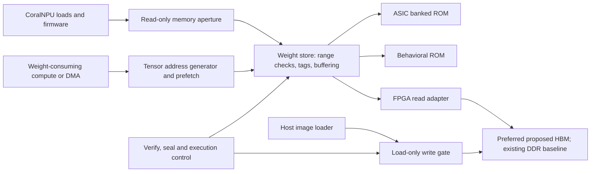

# CoralNPU weight store: ASIC ROM and FPGA DDR/HBM

Status: **HBM is the preferred proposed FPGA ROM-equivalent backend; ASIC ROM
and CoralNPU integration remain proposed.** The implemented ERG-103 first slice
uses sealed DDR and DOT128; this document does not relabel it as HBM or claim a
completed array, full layer or model run. See the [first-slice contract](../spec/first_slice.md)
and its [current evidence report](../../reports/ERG-103/README.md) for that baseline.
Owner: Rachit Tibrewal. Architect/RTL/FPGA reviewers: to be assigned.
Tracking: [ERG-102](https://linear.app/ergodex-ai/issue/ERG-102/week-0-finalize-interface-spec-and-fpga-setup).

## Decision and execution boundary

CoralNPU and its weight-consuming kernels will see a logical read-only weight
store. The same native packed image, descriptors, addresses, byte order and
read-response contract apply to three selectable implementations:

1. ASIC: banked ROM macros containing the model image.
2. RTL simulation: initialized behavioral ROM with explicit latency.
3. FPGA: **prefer a reserved HBM allocation** as the logical ROM-equivalent,
   populated before execution and protected against writes while the model is
   available. Keep the existing sealed-DDR implementation as the correctness
   baseline and an alternative backend; selecting HBM requires a new adapter,
   build and validation. It is a design direction, not a change to ERG-103 RTL.

Only the storage backend changes. Firmware, weight unpacking, arithmetic and
model scheduling must be identical when comparing these implementations.
DDR/HBM substitutes for ROM's contents and read semantics; it does not establish
ASIC ROM area, power, access time or sustained bandwidth. A full on-chip ASIC
ROM implementation remains subject to macro capacity, banking and physical
implementation review.



These are build-time backend choices, not three copies used for each read.
The earlier generic FP32 FPGA projection adapter is a separate diagnostic.
It is not the CoralNPU ROM-equivalent implementation and does not satisfy this
architecture's acceptance gate. Its hardware run is on hold following the
weight-store direction. This design phase does not require that private driver.

## Canonical native weight image

Initial checkpoint: `prism-ml/Bonsai-1.7B-gguf`, revision
`210a9e99f79cb184909d49595906526eb2b3dd9a`, file `Bonsai-1.7B-Q1_0.gguf`.
Input SHA-256:
`3d7c6c90dd98717a203adb22d5eacd2581850e40aa5327e144b97766cae5f7e3`.

| Content | Exact bytes |
| --- | ---: |
| Binary signs for 1,719,904,256 matrix weights | 214,988,032 |
| FP16 scales for 13,436,752 groups of 128 | 26,873,504 |
| 113 FP32 normalization vectors | 495,616 |
| Native tensor payload | 242,357,152 |
| Tensor-start/final alignment padding | 32 |
| Canonical image | 242,357,184 |

The image is approximately 231.13 MiB, excluding the manifest and tokenizer.
It contains 197 Q1_0 matrices and 113 FP32 vectors, in the original GGUF tensor
order. Each tensor starts on a 64-byte boundary; the final image is padded to
64 bytes. Padding is zero. Payload bytes remain unchanged; rows are not padded.
The tied embedding/output head is stored once, with an explicit alias in the
manifest. The largest tensor is 43,680,672 bytes; its 151,669 rows each occupy
288 bytes. Each decoder layer's seven matrices occupy 7,077,888 bytes.

The companion manifest records schema version, source model hash/revision,
image hash/length, tensor name, format, shape, offset, payload length, row stride,
group size, scale encoding and per-tensor hash. The GGUF header, tokenizer and
chat template remain host/firmware metadata; GGUF file offsets are never used
as hardware weight addresses. A format change requires a new schema version.

For a Q1_0 matrix with `columns` divisible by 128:

```text
row_bytes = (columns / 128) * 18
block_offset = tensor.offset + row * row_bytes + group * 18
block[0:2] = little-endian IEEE FP16 scale
block[2:18] = 128 signs, least-significant bit first
weight[j] = (2 * sign[j] - 1) * scale
```

Groups can cross 64-byte lines and 4 KiB boundaries. The consumer must assemble
both pieces before presenting a complete 144-bit group to the arithmetic path.
FP32 norm vectors use their original little-endian four-byte elements. No
whole-model FP32 expansion, requantization or zero padding inside a row is
permitted in this image. A later Gemma or ternary checkpoint needs its own
validated format descriptor and compute support; it cannot reuse Q1_0 tags.

The [image packer](../../utils/weightstore/pack_image.py) creates a fresh output
directory containing `weights.bin` and its manifest, checks every tensor range
against the input, and verifies padding and hashes before publishing the result.
Weights and generated images must remain outside tracked source directories.

## Consumer-facing read contract

The transport is format-independent: one accepted request reads one aligned
64-byte line. Tensor addressing and Q1_0 block assembly sit above it.
Initial streaming parameters are 48-bit logical offsets, 512-bit responses,
8-bit tags per client and 16 outstanding requests per client. These are proposed
interface defaults, not measured throughput or a physical ROM organization.

| Signal | Meaning |
| --- | --- |
| `req_valid`, `req_ready` | Request transfers only when both are asserted |
| `req_offset[47:0]` | Byte offset within the immutable image; low six bits zero |
| `req_tag[7:0]` | Unique among that client's outstanding requests |
| `req_epoch[31:0]` | Image generation accepted by the control plane |
| `rsp_valid`, `rsp_ready` | Response transfers only when both are asserted |
| `rsp_data[511:0]` | Byte at the lowest offset is in bits 7:0 |
| `rsp_tag`, `rsp_epoch` | Echo the accepted request's identity |
| `rsp_status` | OK, alignment, range, stale epoch, backend or integrity error |

There is no consumer write channel. Every accepted request produces exactly
one response, unless the whole store and all clients undergo a coordinated
reset. Responses may reorder across distinct tags; a consumer must reorder them
before block assembly or computation. A tag becomes reusable only when its
response is consumed. Requests and responses remain stable under backpressure.
While a client presents an already outstanding tag, `req_ready` remains low.
Record a sticky protocol fault and assert in verification; do not accept the
duplicate or overwrite the original request. This rule preserves exactly one
response for the original request and does not create an untracked transaction.

Invalid alignment, range or epoch produces an explicit error and zero data,
never a wrapped address or stale payload. Check `offset <= image_bytes - 64`
with widened arithmetic, after checking the image is at least one line long.
The streaming interface accepts no requests before sealing, during verification,
or after a fatal memory fault. The memory-mapped bus adapter must still consume
CPU/DMA transactions and return a completed not-ready error; it must not leave
the system bus waiting indefinitely for a model to load. Fair arbitration and bounded queues isolate stalled consumers;
all credits, reorder slots and outstanding read IDs must be accounted for.

A timeout is a job failure, not permission to release a tag while its memory
transaction might still return. Drain or reset the backend coherently before
reusing IDs. On a fatal fault, stop accepting requests and produce one zero-data error response
for every accepted request without an already queued or presented response.
Queued responses, including any stalled `rsp_valid`, finish unchanged so
backpressure stability is preserved. Retain enough backend
ID state to drain late physical responses into a discard path. No new job or ID
reuse is allowed until those transactions drain or the controller and all clients
are reset together. Do not substitute software/host values for failed reads.

## CoralNPU integration

Keep the existing ITCM, DTCM and core CSR regions intact. Their internal fabric
and SRAM wrappers assume fast fixed-latency behavior; adding a fourth variable
latency memory region to that fabric is not a valid integration.

The initial correctness path is a new read-only external slave reached by
CoralNPU's existing external data-load route. `CoreAxi` sends that traffic
through `DBus2Axi`, with data transactions on ID 0 and optional instruction
fetches on ID 1. The FPGA SoC's TL-UL wrapper/crossbar must retain instruction
classification so the weight aperture can reject instruction fetches. Both
bridges currently use the same AXI ARPROT value, so ARPROT alone is insufficient.
The aperture must reject stores with a bus error that reaches CoralNPU's fault
path, including writes from debug, DMA and other masters.

The external slave converts legal narrow loads into aligned line requests and
returns the correct byte lanes. It implements the bus's actual narrow-access,
ID, response and backpressure rules; it must not assume every core access is a
512-bit read. The v0 proposed read aperture is `0x30000000..0x3fffffff` (256 MiB), with
logical offset zero at `0x30000000`. Add a 128-bit `weights` TL slave in
`CrossbarConfig` and the subsystem wiring; give core and DMA read access.
Reserve the currently unused `0x40080000..0x40080fff` control page. The read
aperture is large enough for this image, not an ASIC capacity commitment.
These addresses do not overlap the current default or high-memory SoC maps.
Models exceeding the aperture require a later versioned window/64-bit addressing
change; there is no silent wrap or dynamic page remapping during execution.
The first bus adapter permits one outstanding access and stitches 128-bit
responses from the shared 512-bit transport. Streaming clients can later use
its full tag/credit interface. CPU CSR and metadata traffic use the control
interconnect. A dedicated streaming client is the throughput path for future
weight-consuming compute units, avoiding serialization through a narrow
peripheral bus. This new client, Q1_0 kernels and full model execution are still
implementation work.

Firmware and compute use logical tensor offsets rather than FPGA physical
addresses. The backend's physical base and channel mapping are private to the
storage adapter and latched when the store is sealed. A small read-only line
cache or double-buffered tile buffer may reduce stalls; cache entries include
the image epoch, and all such state is invalidated on image replacement.
Initial correctness integration uses uncached accesses to avoid stale aliases.
Existing autoboot must additionally wait for weight readiness before launching a
weight-dependent job; the current boot sequence has no such handshake.
Weights have no executable or writable alias. KV cache, activations, scratch
memory and program memory use separate writable allocations.

## Control-plane ABI proposal

The 4 KiB control page has a read-only view for CoralNPU and DMA. Destructive
management commands exist only on the separate trusted FPGA loader interface;
ASIC builds omit that interface. Byte offsets below are little-endian 32-bit
registers. Undefined offsets return a bus error; reserved bits read zero.

| Offset | Register | Semantics |
| --- | --- | --- |
| `0x000` | `ABI_VERSION` | Version 1; incompatible revisions fail driver probing |
| `0x004` | `STATUS` | State enum plus READY, LOCKED, BUSY and FAULT bits |
| `0x008` | `BACKEND` | Behavioral ROM, ASIC ROM, FPGA DDR or FPGA HBM |
| `0x00c` | `EPOCH` | Latched image generation; changes only after coordinated reset/load |
| `0x010..0x014` | `IMAGE_BYTES` | 64-bit padded image length, stable while sealed |
| `0x020..0x03c` | `IMAGE_SHA256` | Eight words of the padded `weights.bin` SHA256 (`image_sha256`), stable while sealed |
| `0x040` | `FAULT_CODE` | First sticky job/store fault; never cleared by a core-only reset |
| `0x044..0x048` | `FAULT_OFFSET` | First offending logical offset |
| `0x050..0x054` | `READS_COMPLETED` | 64-bit snapshot taken after the job drains |
| `0x058..0x05c` | `STALL_CYCLES` | Same snapshot boundary; clock domain recorded in report |
| `0x060` | `WRITES_REJECTED` | Saturating counter and separate saturation status |

V0 `ABI_VERSION` is `0x00010000` (major 1, minor 0). `BACKEND` values are
0 behavioral ROM, 1 ASIC ROM, 2 FPGA DDR, 3 FPGA HBM. `STATUS[2:0]` encodes
EMPTY=0, LOADING=1, VERIFYING=2, SEALED=3, RUNNING=4, FAULT=5. Bits 8/9/10/11
are READY/LOCKED/BUSY/fatal-FAULT; bit 12 reports rejected-write counter saturation.
LOCKED means the loader gate is closed, including EMPTY; READY additionally
requires SEALED/RUNNING, a verified image and a ready backend. BUSY covers RUNNING
or any outstanding operation. Other bits read zero. Digest words 0 through 7
carry successive four-byte chunks of the usual 32-byte SHA256 digest, with each
chunk interpreted little-endian; the textual hexadecimal digest is not reversed.
Fault codes use the response status values below, with zero meaning no fault.

The trusted FPGA management interface has its own relative register namespace,
not an alias writable by CoralNPU. `0x100` accepts command values BEGIN_LOAD=1,
BEGIN_VERIFY=2, COMMIT_SEAL=3, START=4 and STOP=5. Illegal-state commands return
an error and change nothing. BEGIN_VERIFY closes the gate and drains writes;
management status `0x104` bit 0 confirms that drain before host readback begins.
COMMIT_SEAL requires complete, equal expected/readback hashes of the padded
`weights.bin` image and a ready backend. Both management hashes and IMAGE_SHA256
use the manifest's `image_sha256` field; they never use the hash of `manifest.json`.
START requires SEALED; STOP halts new reads and waits for all responses before
returning SEALED. There is no unlock command while an image is sealed.

`0x110/0x114` hold the 64-bit physical base and `0x118/0x11c` the padded image
length, writable only in EMPTY. Expected SHA words occupy `0x120..0x13c` and are
also writable only in EMPTY. Host readback SHA words at `0x140..0x15c` are writable
only in VERIFYING after writes drain; all eight writes are required afresh.
This is a trusted-host verification handshake, not a hardware hashing engine.
Address-range and overflow checks must pass before BEGIN_LOAD opens the gate.
Store reset clears both hash-valid masks. ASIC builds expose fixed image metadata
and omit these management registers.

Response status values are OK=0, ALIGNMENT=1, RANGE=2, STALE_EPOCH=3, BACKEND=4,
INTEGRITY=5, NOT_READY=6 and PROTOCOL=7. Invalid individual requests complete with
an error without invalidating a correctly sealed image; backend/integrity faults
enter FAULT. The bus wrapper maps every non-OK status to its native bus error. Ordinary reads
are served in both SEALED and RUNNING on every backend. START/STOP are optional
FPGA job-accounting controls, not prerequisites for reading ASIC ROM. A common
quiescent/drained boundary snapshots counters on ASIC as well. STOP requires
upstream clients to be quiesced first; returning to SEALED does not authorize
ongoing clients to restart a stopped job.
These are specified v0 encodings. The first slice implements the DDR subset at
its BAR0 interface; ASIC/HBM variants and the CoralNPU address-map integration
remain proposed. HBM must report BACKEND=3 only in an actual HBM implementation;
the current DDR implementation reports 2. Hardware comparisons require matching
ABI, image digest, epoch and backend. A multi-channel physical mapping needs a
versioned management descriptor; this design allocates no new CSR offsets.

## Loading, sealing and reset

FPGA states are `EMPTY -> LOADING -> VERIFYING -> SEALED -> RUNNING -> SEALED`.
A fatal backend/integrity error enters `FAULT`. ASIC builds start unavailable
until reset, macro readiness and the fixed image descriptor are valid, then
enter `SEALED`; their loader write port is absent.

1. Hold compute clients stopped. Select a validated image descriptor and reserve
   a disjoint DDR/HBM allocation. Open only the dedicated host loader's write
   route to that allocation. All other masters are denied writes at all times.
2. Upload the exact image, including padding. Finish all write address/data
   transfers, receive every write response and drain posted PCIe writes.
3. Close the loader gate and drain remaining writes before verification starts.
   Read the allocation back and compare its whole-image hash with the manifest.
   The initial implementation may use a trusted host readback hash; a software
   digest written to a CSR alone is not evidence that memory was verified.
4. Seal the image: latch base, length, layout, digest, backend identity and epoch.
   Block descriptor/base changes and every write path to the allocation. Only
   then expose readiness and allow compute execution.
5. On completion, stop new requests and drain responses before declaring idle.
   Keep the image sealed for another query. V1 image replacement requires a
   coordinated cold reset and a fresh load/verification cycle.

The write gate must cover PCIe PCIS, any CL DMA/debug/test master, CPU stores
and address aliases. Disabling a host API is not sufficient. For AXI writes,
handle independently arriving AW and W channels and drain rejected bursts
before returning an error; never deadlock a writer by leaving W outstanding.
Do not reset only this gate while leaving a writable alternate path enabled.

A warm core reset does not unlock or change the weight image. Normal warm resets
must first quiesce clients and drain outstanding reads. An unexpected client
reset faults the job and drains backend responses into a discard path before
IDs can be reused. A store/controller reset drops readiness, blocks all clients
and invalidates the manifest/epoch/cache even if external DRAM retains bytes.
It must be coordinated with outstanding memory traffic. A new execution cannot
resume until verification and sealing complete again.

This is functional ROM emulation, not tamper-resistant storage: a privileged
operator can replace the FPGA image or reset the device. Test reports must bind
the run to its AFI, image hash and seal status, and detect changes during the run.

## FPGA and ASIC backend mapping

**Current DDR baseline:** the ERG-103 wrapper connects a 512-bit guarded DDR
path to `sh_ddr`, with no HBM connection (`fpga/aws_f2/first_slice/cl_bonsai_first_slice.sv:19`).
Its store has 16 logical request slots but admits only one physical backend read
at a time (`hdl/verilog/first_slice/weight_store.sv:55`, `:299`). Keep that baseline
and its evidence unchanged. New HBM results require their own source-bound run.

**Preferred proposed HBM backend:** adapt the unchanged logical line protocol to
reserved HBM, retaining native packed bytes, tensor offsets, image digest and
epoch. The pinned AWS [memory example](https://github.com/aws/aws-fpga/blob/b603a81f65666e0cf7a67ee5cf18b148eb6b08c3/hdk/cl/examples/cl_mem_perf/README.md#hbm)
describes 16 GiB and 32 AXI3 ports, with 512 MiB channel address regions. The
242,357,184-byte fixture fits even one such region if wholly available; this is
capacity arithmetic, not a measured bandwidth, latency or 27B-model fit claim.
Choose the reserved channel set and leave activations, KV cache and other clients
in disjoint protected allocations.

The [pinned adapter RTL](https://github.com/aws/aws-fpga/blob/b603a81f65666e0cf7a67ee5cf18b148eb6b08c3/hdk/cl/examples/cl_mem_perf/design/cl_mem_hbm_axi4.sv#L73)
has 256-bit AXI3 data, 34-bit addresses, 6-bit IDs and 4-bit burst lengths. A
64-byte logical line is two aligned 32-byte beats on that interface. The actual
wrapper forces SIZE=5 and allows at most 16 beats (512 bytes) per native burst;
it must not receive a narrow access whose size is silently widened. Split physical
bursts at stripe/channel, 4 KiB and controller limits; check every response ID,
status and final beat before publishing the assembled line. The example converts
512-bit AXI4 and crosses from the 250 MHz main domain to an HBM domain whose
example target is 450 MHz. Neither clock is achieved timing for our new adapter
or array. Its host path muxes **port 15** (`MAP_PORT=15`), despite README text
saying channel 0; that ingress port must not be confused with a sealed allocation
or assumed to provide 32 independently concurrent read streams. Port selection
is an ingress choice, not access isolation: enforce the reserved physical address
policy on every port after routing. The example converter discards upper address
bits and forces downstream IDs to zero; validate full input bounds before any
width reduction rather than inheriting an alias or promising ID concurrency.

### 27B capacity and addressability gate

The planned 27B product is a separate model target. The 256 MiB v0 aperture and
current first-slice image limit cover the pinned 1.7B fixture; they do not expose
all 16 GiB of physical HBM. A 48-bit request offset or 64-bit length register alone
is not an implemented large-image capability. More HBM channels or physical
striping cannot enlarge that logical limit.

Before a full 27B image is supported, freeze a versioned capacity/addressing ABI:
an expanded aperture or wider global streaming/descriptor path with a reviewed
CoralNPU access scheme, or an explicit banked/window interface. Every operation
must resolve to an unambiguous full-image logical offset. Bank identity must be
part of an accepted request or immutable sealed mapping; changing a global
window while requests, cached lines or staged operands are live is not allowed.
Retain whole-image hash/epoch/seal semantics across all banks, checked bounds and
no writable aliases. This document allocates no larger address range or new CSR.

No exact 27B checkpoint, packed image or runtime memory budget is established
here. If exactly 27 billion values each used two bits, their codes alone would
occupy 6,750,000,000 bytes (about 6.29 GiB). That illustrative subtotal is neither
the checkpoint size nor a claim that the model and runtime fit in HBM. Before a
fit claim, publish a budget extracted from the selected immutable checkpoint and
validated packed image, with the declared workload limits:

| Budget component | Required accounting |
| --- | --- |
| Quantized weights | Actual tensor shapes/formats and stored code bytes, group scales, zero points or other format metadata; no assumed two-bit format |
| Other tensors | All non-ternary/higher-precision tensors, including normalization and any embeddings/output heads retained in another format; count a tied alias once only when verified |
| Layout and placement | Image padding, physical allocation slack and reserved channel/controller capacity; exact per-channel occupied ranges and placement of host-only metadata |
| Writable runtime | KV-cache format and allocation at maximum supported context, batch/concurrent sequences, activation/result buffers, scratch, staging and peak kernel workspace; state which bytes reside in HBM, DDR or on-chip memory |

Keep KV/cache and other writable allocations outside the sealed weight image.
Sum peak simultaneous residency without double counting, declare safety margin,
and compare against the HBM capacity actually reserved for this workload rather
than assuming all 16 GiB is free. Prove accesses above the v0 limit, every bank's
highest valid line, overflow/alias rejection, and full logical readback/hash on
the new ABI before reporting full-image support. Capacity, bandwidth and actual
model inference remain separate acceptance claims.

### Channel mapping and concurrency proposal

Start with one declared channel/allocation to prove equivalence, then measure
striping over a declared set C of P channels. Proposed stripe size S is a
power-of-two multiple of 64 bytes; compare 64-byte and 4 KiB stripes using real
row-stride request traces before freezing the choice. For logical byte offset x:

```text
q = floor(x / S)
channel = C[q mod P]
channel_local_offset = floor(q / P) * S + (x mod S)
```

Translate this local offset through the selected channel's reserved physical
base using checked arithmetic and the controller's actual address routing.
The formula is a candidate mapping, not existing RTL. Reject capacity/overflow
violations; do not truncate upper address bits. Latch channel set, base/length
per channel, S and map version before loading and seal them with the image.
All loader writes, logical readback/hash, consumer reads and final readback must
use the same mapping. Hash the exact canonical image in logical byte order;
physical allocation slack is not appended to `weights.bin`. Protect that slack
and all aliases as part of the reserved allocation. Within the v0 image limit, firmware tensor addresses
and the 256 MiB logical aperture do not change when channels change. Larger-model
addressability requires the separate versioned change above.

HBM bandwidth is usable only if prefetch, reorder storage, CDC and the consumers
support enough concurrent transactions. Sixteen 64-byte logical credits expose
at most 1,024 bytes in flight; the existing single-physical-read adapter is
stricter. Size credits from measured latency and required bandwidth, then prove
per-channel ID ownership and late-response drain before increasing them. The
vendor performance kernel's many outstanding accesses are not features of our
store, and its benchmark is not an array result. Reordering must preserve each
logical tag/epoch and complete 18-byte groups that cross lines or stripes.

### Immutability, initialization and failure gates

HBM is volatile DRAM, used here for read-only behavior after load; it is not
nonvolatile ASIC ROM. Load the unchanged image, close admission, drain every
accepted and posted write, read back the entire logical image, compare its hash,
and then seal. Keep the trusted-host hash handshake explicit; no hardware hash
engine is implied. After power loss, reconfiguration or HBM/controller reset,
readiness and every cached/staged epoch are invalid: reload, verify and seal
again even if some bytes appear retained. Core-only reset must not reopen writes.

The seal must cover **every route to the physical allocation**, not only the
loader API: PCIS/BAR aliases, any shell DMA enabled by the chosen shell, the
secondary AXI master, test traffic generators/scrubbers, HBM performance engines,
and any added CPU/DMA/debug writer. Reject upper-address aliases after checked
translation. The pinned [PCIS decoder](https://github.com/aws/aws-fpga/blob/b603a81f65666e0cf7a67ee5cf18b148eb6b08c3/hdk/cl/examples/cl_mem_perf/design/cl_mem_pcis_dec.sv#L968)
even routes a DDRB-named test/scrub path into HBM. Remove test writers from the
production backend or place them behind the same hardware seal. Disabling just
the scrubber or a software enable is insufficient. Read-only observation logic
may remain; any future debug mutation/reset path needs the same guard.

Lock or omit performance mux, address-map, clock/reset and destructive controller
configuration while sealed. An unavoidable external reset or loss of readiness
immediately fails the job and requires coordinated recovery; it must never
quietly restart with an old epoch. Wait for required stack initialization,
clock/CDC readiness and empty transaction queues before sealing. Use the pinned
[wrapper RTL](https://github.com/aws/aws-fpga/blob/b603a81f65666e0cf7a67ee5cf18b148eb6b08c3/hdk/cl/examples/cl_mem_perf/design/cl_mem_hbm_wrapper.sv#L219)
and its two stack-ready bits [2:1]; bit 3 is reserved zero despite an
outdated comment asking for [3:1]=111. Polling, timeout and reset scope must come
from the actual integrated wrapper, not copied example comments.

On backend/protocol/integrity failure, stop admission, preserve held responses,
return one failure for each unfinished accepted logical read and drain late
physical beats across every selected channel before IDs are reused. Record
first fault and controller/AXI error status; freeze any error-clear operation
needed to preserve run evidence. Do not inherit the example performance
checker, which tests RRESP only on RLAST: our adapter must check every beat.
The wrapper leaves some parity, APB-functional-error and thermal outputs
unconnected, so ECC configuration and required error/thermal telemetry are open
review items, not established protection. A hardware-error or reset event invalidates
the job and partial output; no host/DDR substitution can count as an HBM pass.

No example PCIS address, HBM port number or reset CSR is allocated to CoralNPU by
this document. The chosen shell's supported loader and all protection/CDC/AXI
adapters must be reviewed together. The existing Small Shell has no built-in
XDMA engine; a larger example's DMA path must not be assumed in this baseline.

The ASIC backend maps the same logical lines onto banked ROM words, handles
macro latency, and produces the same response protocol. Banking and physical
word width are implementation parameters; a 512-bit transport does not require
a single 512-bit ROM macro. Record macro family, capacity, ECC policy, bank
conflicts, ports and access timing. A 231 MiB logical store is not a demonstrated
on-chip area fit. Larger model targets need separate capacity/layout estimates.

## Week 0 boundary

ERG-102 froze the initial contract and packed-image fixture and brought up the
FPGA shell. The first-slice DDR/store/loader implementation followed in ERG-103;
its current evidence remains separate. ASIC/behavioral-ROM backend equivalence,
HBM, CoralNPU wiring and model inference are follow-on implementation deliverables.
They are not new requirements to build a complete inference system in Week 0.
Their gates below belong to the corresponding implementation PRs. Week 0 still
requires actual physical shell/MMIO evidence and the reviewed interface baseline.

## Verification and follow-on deliverables

The HBM implementation PR must preserve the frontend/loader contract, add a
source-bound HBM adapter and runnable equivalence/immutability harness, and
report actual selected channels, mapping, clocks, outstanding reads and errors.
CoralNPU wiring and ASIC backend work retain their own acceptance gates. Begin
with HBM correctness and add striping/prefetch only with measured evidence.
Every PR includes a committed report, simulator commands, source/image hashes
and actual FPGA results for its scope.

| Gate | Required evidence |
| --- | --- |
| Initial 1.7B image contract | All 310 tensor payloads and padding independently verified; exact model/image hashes; shared head alias |
| 27B capacity/addressability | Pinned checkpoint and complete residency budget; reviewed versioned addressing/bank map; above-v0/bank-limit/alias tests and whole-image hash; no inference or throughput implied |
| Read protocol | Random stalls, response reordering, tag exhaustion/reuse, boundary/alignment errors and no lost/duplicate responses |
| Q1_0 addressing | First/last rows and groups, groups crossing lines/4 KiB, FP16 scale/sign order and F32 norm reads |
| ROM/DDR/HBM equivalence | Identical logical request streams and bytes/status against one independent image oracle; channel/stripe boundaries, reordering and different latency |
| Immutability | Writes rejected from every master/alias/test writer after seal; writes racing seal drained on all channels; mapping/reset/performance bypasses blocked; full logical hash before/after |
| Reset/fault behavior | Warm/cold reset, outstanding reads/writes, bad hashes, controller not ready, AXI errors and no stale response reuse |
| CoralNPU integration | Real firmware loads weights; correct lane extraction; store and instruction-fetch faults; identical kernel outputs across backends |
| FPGA execution | Named AFI, load/readback/seal logs, physical request counters, error counters, hash before/after and no host compute substitution |
| Model demonstration | Same tokenizer/prompt and numerics; complete generated token IDs/text and intermediate tensor comparisons with a fixed reference |
| ASIC implementation | ROM macro fit and separate synthesis, timing, bandwidth and power evidence |

Run the new RTL protocol tests on Verilator and Arcilator where supported;
record any frontend or harness gap instead of counting it as a pass. Use the
AWS shell memory simulation for each DDR/HBM adapter before hardware. FPGA timing is
measured as FPGA timing; a separate bank/latency model estimates ASIC behavior.
HBM bandwidth cannot be cited as measured ROM bandwidth.

Current DDR implementation evidence is tracked in the ERG-103 report, including
its explicitly stated execution scope. The earlier 1,332-target baseline,
four-configuration Arcilator pilot and AWS shell-example tests do not validate
an HBM backend or array. No HBM execution, ASIC ROM fit, full-model inference or
CoralNPU-generated token result is established by this design change.
